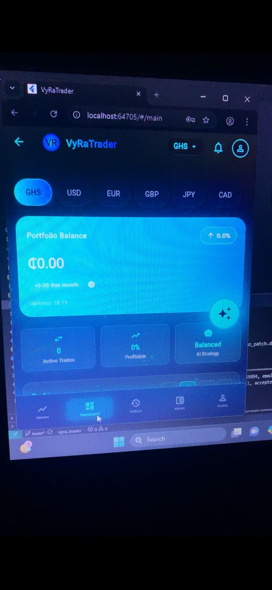
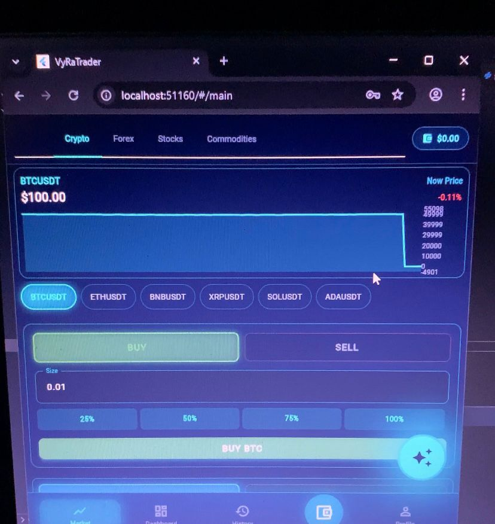
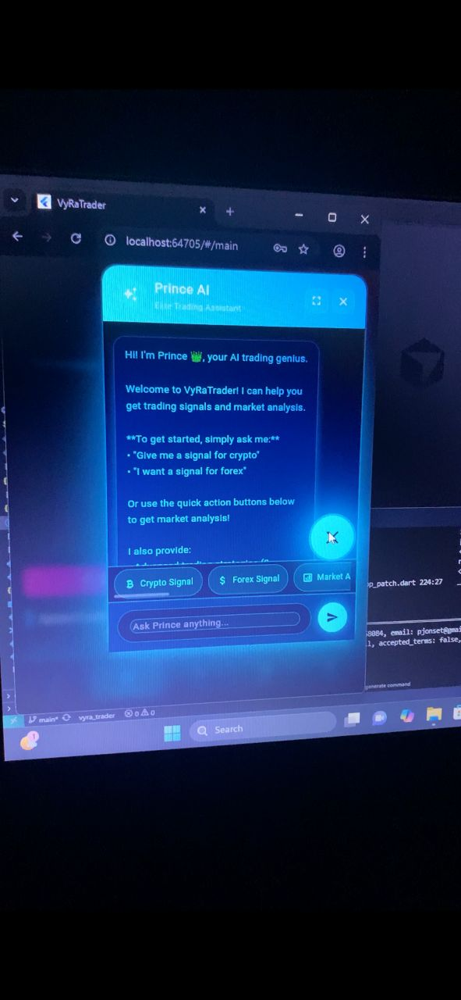

# 🚀 VyRaTrader - AI-Powered Trading Platform

An institutional-grade trading platform that combines 20+ AI trading strategies to generate high-probability signals for cryptocurrencies, forex, and stocks. Features an AI assistant named Prince that provides real-time trading recommendations and automated portfolio management.

## 🚀 Live Demo

*Backend API:* https://vyratrader.onrender.com  

*Demo Video:* https://youtu.be/LGJbgguBsng?si=OzlT8Srnq-gFPpJT  

📱 *Note:* Mobile-first application built with Flutter. Full demo available in video above.

> ⚠ Backend hosted on free tier - may take 30 seconds to wake from sleep on first request.



## ✨ Key Features

- 🤖 **Prince AI Assistant** - Context-aware trading advice and strategy explanations
- 📊 **20+ Trading Strategies** - Institutional techniques including VWAP, Order Blocks, Fair Value Gaps, and Market Structure analysis
- 💰 **Multi-Currency Payments** - Support for Mobile Money (MTN, Vodafone), Stripe, PayPal, and cryptocurrency (USDT, BTC, ETH)
- 📈 **Real-Time Portfolio Tracking** - Live P&L, performance metrics, and risk analytics
- 🔔 **Signal Notifications** - Telegram integration for instant trading alerts
- 🌍 **Multi-Asset Support** - Trade crypto, forex pairs, and stock indices from one platform

## 🛠️ Tech Stack

### Backend
- **FastAPI** (Python) - High-performance async web framework
- **PostgreSQL/SQLite** - Database with SQLModel/SQLAlchemy ORM
- **Redis** - Caching and session management
- **Alembic** - Database migrations

### Frontend
- **Flutter/Dart** - Cross-platform development (iOS, Android, Web)
- **Provider** - State management
- **WebSocket** - Real-time data streaming
- **Google Mobile Ads** - Monetization

### AI/Trading
- **Custom Ensemble Model** - 20+ trading strategies with weighted consensus
- **Institutional Strategies** - VWAP, Order Blocks, Fair Value Gaps, Market Structure
- **Technical Indicators** - RSI, MACD, Volume analysis, Trend following
- **Risk Management** - Automated stop-loss, position sizing, portfolio limits

### Integrations
- **Binance & OANDA APIs** - Trade execution
- **Stripe/PayPal/Mobile Money** - Payment processing
- **Telegram** - Signal notifications

## 📸 Screenshots






## 🎯 What Makes This Special

- **Democratizes institutional-level trading strategies** - Makes professional trading tools accessible to everyone
- **Full payment processing for African mobile money** - MTN, Vodafone, AirtelTigo integration
- **Cross-platform application built from scratch** - Native iOS, Android, and Web support
- **AI-powered signal filtering** - Ensures only high-quality signals reach users
- **Complete risk management system** - Automated position sizing and stop-loss protection

## 🏗️ Architecture Highlights

- **Asynchronous backend architecture** - Full async/await implementation for optimal performance
- **Modular strategy system** - Easy to add new trading strategies
- **Secure JWT authentication** - With transaction PIN for additional security
- **Real-time WebSocket streaming** - Live market data and signal updates
- **Database migrations with Alembic** - Version-controlled schema evolution

## 📁 Project Structure

```
vyra_trader/
├── backend/              # FastAPI backend application
│   ├── app/
│   │   ├── api/         # API route handlers
│   │   ├── ai/          # AI engine and ensemble
│   │   ├── core/        # Configuration and security
│   │   ├── db/          # Database models and session
│   │   ├── services/    # Business logic services
│   │   ├── strategies/  # Trading strategy implementations
│   │   └── main.py      # Application entry point
│   ├── alembic/         # Database migrations
│   └── requirements.txt # Python dependencies
├── frontend/            # Flutter frontend application
│   ├── lib/
│   │   ├── core/       # Core utilities and configuration
│   │   ├── models/     # Data models
│   │   ├── providers/  # State management
│   │   ├── screens/    # UI screens
│   │   ├── services/   # API clients and services
│   │   └── widgets/    # Reusable UI components
│   └── pubspec.yaml    # Flutter dependencies
├── signal_generator.py  # Standalone signal generation service
├── config/              # Configuration files
└── services/            # Shared services (Telegram, AI filter)
```

## 🔒 Security Features

- **JWT Authentication** - Secure token-based authentication
- **Encrypted Storage** - Sensitive data encryption at rest
- **Transaction PIN** - Additional security layer for financial operations
- **Secure API Communication** - HTTPS and CORS protection

## 🚀 Getting Started

### Prerequisites

- Python 3.9+
- Flutter SDK 3.0+
- PostgreSQL (production) or SQLite (development)
- Redis (optional, for caching)

### Backend Setup

```bash
# Install dependencies
pip install -r backend/requirements.txt

# Configure environment variables
cp backend/env.example .env

# Run database migrations
cd backend
alembic upgrade head

# Start the server
uvicorn app.main:app --reload
```

### Frontend Setup

```bash
# Install dependencies
cd frontend
flutter pub get

# Configure environment
cp .env.example .env

# Run the app
flutter run
```

### Signal Generator

```bash
# Configure AI provider and Telegram bot
# Edit config/settings.py

# Run signal generator
python signal_generator.py
```

## 📚 Documentation

For detailed technical documentation, see [TECHNICAL_DOCUMENTATION.md](TECHNICAL_DOCUMENTATION.md)

## 📝 License

This project is proprietary software. All rights reserved.

---

💼 **Open to remote software development opportunities**

📧 [pjonset@gmail.com] | 💼 [https://www.linkedin.com/in/prince-owusu-gyimah-92052935b?utm_source=share&utm_campaign=share_via&utm_content=profile&utm_medium=ios_app] | 🐙 [https://github.com/prince-west]

